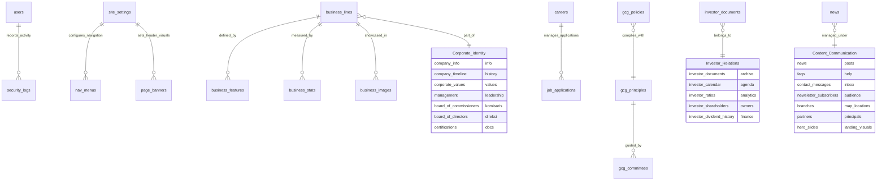

# 🛠️ Technical Documentation: Source Code & Database

## 1. Arsitektur Source Code (Frontend)
Aplikasi dibangun menggunakan infrastruktur modern dengan fokus pada performa, SEO, dan estetika premium.

### 🧩 Tech Stack Utama
- **Framework:** React 18 (Vite as Build Tool)
- **Language:** TypeScript (Type-safety)
- **Styling:** Tailwind CSS (Modern Utility-first)
- **Animation:** Framer Motion (Premium Transitions)
- **Back-end as a Service (BaaS):** Supabase (PostgreSQL, Auth, Storage)
- **Icons:** Lucide React

### 📁 Struktur Direktori `src/`
- **`/components`**: Komponen UI yang dapat digunakan kembali.
  - `layout/`: Header, Footer, Sidebar Admin.
  - `sections/`: Seksi-seksi di halaman utama.
  - `ui/`: Komponen dasar seperti Button, Input, Modal.
- **`/pages`**: Halaman utama aplikasi.
  - `public/`: Halaman yang bisa diakses pengunjung.
  - `admin/`: Panel manajemen konten.
- **`/contexts`**: Manajemen state global (Auth, Language).
- **`/lib`**: Konfigurasi eksternal (Supabase client).
- **`/hooks`**: Custom React hooks.

---

## 🗄️ 2. Arsitektur Database (Supabase / PostgreSQL)

### 📊 Daftar Tabel Utama

| Nama Tabel | Fungsi |
| :--- | :--- |
| `users` | Data Admin (Super Admin, Editor, dll). |
| `site_settings` | Konfigurasi global website (Logo, Site Name). |
| `nav_menus` | Navigasi Header & Footer dinamis. |
| `hero_slides` | Slider utama di halaman beranda. |
| `company_info` | Detail profil perusahaan di halaman About. |
| `company_timeline` | Peristiwa sejarah perusahaan. |
| `corporate_values` | Nilai-nilai inti (Core Values). |
| `management` | Profil Board of Directors. |
| `board_of_commissioners` | Profil dewan komisaris. |
| `board_of_directors` | Profil tim manajemen operasional. |
| `gcg_principles` | Prinsip Good Corporate Governance. |
| `gcg_committees` | Komite audit dan GCG. |
| `gcg_policies` | Kebijakan legal dan kepatuhan. |
| `business_lines` | Kategori bisnis (Farmasi/Consumer). |
| `business_features` | Detail item di dalam lini bisnis. |
| `business_stats` | Statistik performa lini bisnis. |
| `business_images` | Galeri foto operasional. |
| `branches` | Lokasi kantor cabang (Lat/Long). |
| `partners` | Daftar prinsipal global. |
| `investor_documents` | File repository PDF (Laporan Keuangan). |
| `investor_calendar` | Agenda korporasi (RUPS). |
| `investor_ratios` | Rasio keuangan. |
| `investor_shareholders` | Komposisi pemegang saham. |
| `investor_dividend_history` | Riwayat dividen. |
| `news` | Artikel berita dan siaran pers. |
| `certifications` | Sertifikat kepatuhan (CDOB, ISO). |
| `careers` | Lowongan pekerjaan. |
| `job_applications` | Database kiriman CV pelamar. |
| `contact_messages` | Log pesan masuk formulir kontak. |
| `security_logs` | Catatan audit aktivitas admin. |

---

## 🗺️ 3. Entity Relationship Diagram (ERD)

Berikut adalah diagram hubungan antar tabel untuk seluruh sistem PT Penta Valent Tbk:

### Penjelasan Relasi:
1. **Business Module:** Tabel `business_lines` adalah entitas utama yang membawahi fitur, statistik, dan galeri gambar.
2. **Security & Audit:** Setiap aktivitas `users` dicatat secara kronologis dalam `security_logs`.
3. **Recruitment:** Data pelamar kerja (`job_applications`) terikat secara wajib ke posisi yang tersedia di `careers`.
4. **Global Config:** `site_settings` menjadi pusat data untuk UI global seperti menu dan banner.
5. **Standalone Assets:** Modul seperti `news`, `faqs`, dan `partners` berdiri sendiri namun tetap dikelola melalui otentikasi admin yang sama.
